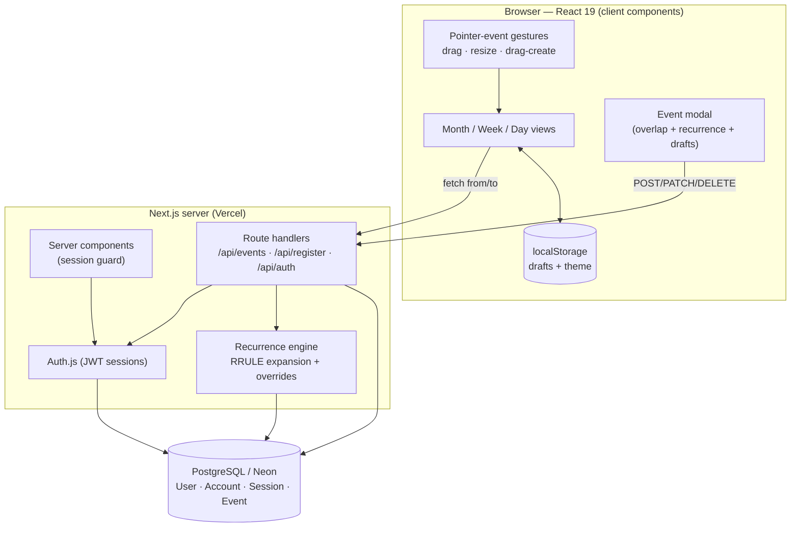
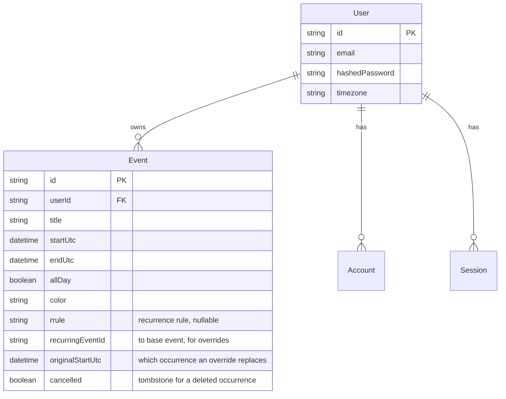

# Calendar — a Google Calendar clone

A high-fidelity, full-stack Google Calendar clone with month / week / day views,
drag-and-drop + resizable events, recurring events, timezone-correct storage,
overlap detection, offline drafts, and authentication.

> **Live demo:** https://google-calendar-ruddy.vercel.app
> **Stack:** Next.js 16 (App Router) · React 19 · TypeScript · Tailwind CSS v4 · PostgreSQL (Neon) · Prisma 7 · Auth.js (NextAuth v5) · Framer Motion

---

## Table of contents

1. [Features](#features)
2. [Tech stack & why](#tech-stack--why)
3. [Architecture](#architecture)
4. [Data model](#data-model)
5. [Local setup](#local-setup)
6. [Environment variables](#environment-variables)
7. [Business logic & edge cases](#business-logic--edge-cases)
8. [Animations & interactions](#animations--interactions)
9. [Keyboard shortcuts](#keyboard-shortcuts)
10. [Deployment (Vercel)](#deployment-vercel)
11. [Future enhancements](#future-enhancements)
12. [Theory Questions](#theory-questions)

---

## Features

**Core**
- 📅 **Month, Week, and Day views** that closely mirror Google Calendar.
- ✍️ **Create / edit / delete** events through an animated modal.
- 🖱️ **Drag to move**, **drag edges to resize**, and **drag on empty grid to create** — all via the Pointer Events API (works with touch).
- ↔️ **Drag events across days** in month view.
- 🧱 **Overlap detection** — clashing events are detected and the user is warned before saving.
- 🌍 **Timezone correctness** — every timestamp is stored in **UTC** and rendered in the **viewer's local timezone**.
- 🔢 **Smart event layout** — overlapping events split into side-by-side columns.

**Bonus**
- 🔐 **Authentication** — email/password (hashed) **and** Google OAuth (Auth.js).
- 🔁 **Recurring events** — daily / weekly / monthly via the iCalendar `RRULE` standard.
- ✂️ **Edit or delete a single occurrence** of a series, or the whole series.
- 💾 **Offline draft support** — an in-progress new event is persisted to `localStorage` and survives reloads / connection drops.

**Surprises** 🎁
- ⌨️ **Keyboard shortcuts** (Google-style: `m` `w` `d`, `t`, `n`/`p`, `c`).
- 🌗 **Dark mode** with persisted preference.
- 🔴 **Live "current time" indicator** line in week/day views.
- 🗓️ **Mini-month navigator** in the sidebar.

---

## Tech stack & why

| Concern | Choice | Why |
|---|---|---|
| Framework | **Next.js 16 (App Router)** | One codebase for the React frontend and the REST API (route handlers); server components keep auth checks on the server. |
| Language | **TypeScript** | End-to-end types from the DB (Prisma) through the API to the UI. |
| Styling | **Tailwind CSS v4** | Rapid, consistent styling needed to match Google Calendar's dense layout. |
| Database | **PostgreSQL on Neon** | Relational integrity for users/events; Neon's **serverless driver** talks over HTTP/WebSocket, which avoids connection-pool exhaustion on Vercel's serverless functions. |
| ORM | **Prisma 7** | Type-safe queries + a declarative schema that doubles as the migrations source. |
| Auth | **Auth.js / NextAuth v5** | Battle-tested; supports credential + OAuth providers with a Prisma adapter and stateless JWT sessions. |
| Dates | **date-fns / date-fns-tz** | Small, pure date math + timezone formatting. |
| Recurrence | **rrule** | Implements RFC 5545 `RRULE`; we store the rule and expand occurrences on demand. |
| Animation | **Framer Motion** | Declarative spring animations for the modal and view transitions. |
| Validation | **zod** | Runtime validation of every API payload. |

---

## Architecture



**Request flow for loading a view:** the active view computes a `[from, to]` window →
`GET /api/events?from&to` → the API loads the user's one-off events intersecting the
window **plus** every recurring base/override → the **recurrence engine expands** these
into concrete occurrences for that window → the client lays them out and renders.

Storing only the recurrence *rule* (not millions of materialized rows) keeps the table
small; occurrences are computed lazily per requested window.

### Source layout

```
src/
├─ app/
│  ├─ api/
│  │  ├─ auth/[...nextauth]/   Auth.js handler
│  │  ├─ events/              GET (list+expand) · POST (create)
│  │  ├─ events/[id]/         PATCH · DELETE (recurrence scopes)
│  │  └─ register/            email/password sign-up
│  ├─ login/ · register/      auth pages
│  └─ page.tsx                protected calendar (server component)
├─ components/                Calendar, Header, Sidebar, MonthView,
│                             TimeGridView, EventModal, AuthForm
├─ lib/                       prisma, auth helpers, recurrence, overlap,
│                             layout (column packing), dates, time, drafts
└─ auth.ts                    NextAuth configuration
```

---

## Data model



A **single `Event` table** models three cases, which keeps the schema simple:

| Case | `rrule` | `recurringEventId` | Notes |
|---|---|---|---|
| One-off event | `null` | `null` | A normal event. |
| Recurring **base** | set | `null` | The "master"; occurrences are expanded from `startUtc` + `rrule`. |
| **Override** of one occurrence | `null` | → base id | `originalStartUtc` marks the occurrence; `cancelled=true` tombstones a deleted occurrence. |

Migrations live in [`prisma/migrations`](prisma/migrations) and are generated from
[`prisma/schema.prisma`](prisma/schema.prisma).

---

## Local setup

**Prerequisites:** Node 20+, a PostgreSQL database (a free [Neon](https://neon.tech) project works great).

```bash
# 1. Install dependencies
npm install

# 2. Configure environment
cp .env.example .env
#   then edit .env and set DATABASE_URL (and optionally Google OAuth).
#   Generate an auth secret:
npx auth secret        # writes AUTH_SECRET, or set it yourself

# 3. Create the database schema
npx prisma migrate dev --name init

# 4. Run the dev server
npm run dev            # http://localhost:3000
```

Create an account on the sign-up page, or use **Continue with Google** if you configured OAuth.

---

## Environment variables

| Variable | Required | Description |
|---|---|---|
| `DATABASE_URL` | ✅ | PostgreSQL connection string (Neon pooled URL). |
| `AUTH_SECRET` | ✅ | Secret used to sign session JWTs. Generate with `npx auth secret`. |
| `AUTH_URL` | ✅ | App base URL (`http://localhost:3000` locally; your Vercel URL in prod). |
| `AUTH_GOOGLE_ID` / `AUTH_GOOGLE_SECRET` | optional | Google OAuth credentials. If omitted, the Google button is hidden and email/password still works. |

See [`.env.example`](.env.example).

---

## Business logic & edge cases

- **UTC storage, local display.** All timestamps are persisted as UTC. The UI reads the
  viewer's IANA timezone (`Intl.DateTimeFormat().resolvedOptions().timeZone`) and renders
  with `date-fns-tz`. Editing happens in local time and is converted back to UTC on save.
- **Overlap detection.** Before saving, the candidate event is tested against the events in
  the visible window using a half-open interval test (`aStart < bEnd && bStart < aEnd`), so
  back-to-back events (one ending exactly when the next begins) do **not** count as a clash.
  All-day events are treated as a separate lane. The user is warned but may still save.
- **Recurring expansion window.** Occurrences are only expanded for the requested
  `[from, to]` window, and the search start is offset by the event's duration so a long
  occurrence that *starts* before the window but *ends* inside it still appears.
- **Single-occurrence edits.** Editing/deleting one instance of a series creates an
  **override** row (or a `cancelled` tombstone) rather than mutating the base, so the rest
  of the series is untouched. Moving an occurrence to a new time is also stored as an override.
- **Multi-day & cross-midnight events.** Events are clamped to each day column they touch, so
  a 23:00–01:00 event renders correctly in both days.
- **Spanning / column packing.** Overlapping timed events are grouped into clusters and packed
  into the minimum number of side-by-side columns.
- **Optimistic UI.** Drag/resize updates the UI immediately, persists in the background, then
  reconciles with a refetch so the source of truth stays the server.
- **Ownership checks.** Every API route verifies the event belongs to the signed-in user.
- **Known limitation — DST.** Recurrence is expanded in UTC, so an event recurring across a
  daylight-saving boundary can shift by an hour in local time. Fully DST-correct recurrence
  would expand in the event's own timezone (noted under future enhancements).

---

## Animations & interactions

- **Modal** — Framer Motion springs the dialog in (`scale` + `y` + `opacity`) and fades the
  backdrop; `AnimatePresence` animates the exit too.
- **Drag / resize / drag-create** — implemented with the **Pointer Events API** rather than
  HTML5 drag-and-drop, so the same code handles mouse and touch. A gesture captures the
  event's original times once; every `pointermove` recomputes new times from the pointer's
  delta, **snapped to 15-minute increments**, and renders a translucent "ghost" preview.
  Pixel offsets convert to minutes via `y / gridHeight × 1440`.
- **Current-time line** — a red indicator updates every minute.
- **Theme** — dark mode toggles a `.dark` class on `<html>` (Tailwind v4 `@custom-variant`),
  with the preference saved to `localStorage`.

---

## Keyboard shortcuts

| Key | Action |
|---|---|
| `m` / `w` / `d` | Month / Week / Day view |
| `t` | Jump to today |
| `n` / `→` | Next period |
| `p` / `←` | Previous period |
| `c` | Create a new event |
| `Esc` | Close the modal |

---

## Deployment (Vercel)

1. Push this repo to GitHub.
2. Import it into [Vercel](https://vercel.com/new).
3. Add the environment variables from the table above (use your Neon URL and your Vercel
   domain for `AUTH_URL`). If using Google OAuth, add
   `https://<your-domain>/api/auth/callback/google` as an authorized redirect URI.
4. `prisma generate` runs automatically on build; apply migrations with
   `npx prisma migrate deploy` (run once locally against the prod DB, or as a build step).

---

## Future enhancements

- **DST-correct recurrence** by expanding `RRULE` in the event's own timezone.
- **Real-time sync** across devices via WebSockets/SSE and incremental **sync tokens**.
- **Richer recurrence UI** (e.g. "every 2nd Tuesday", custom end dates, `COUNT`/`UNTIL`).
- **Reminders / notifications** and **invitees / sharing**.
- **Search & command palette** for fast navigation and natural-language quick-add.
- **Offline-first write queue** that replays mutations made while offline.

---

## Theory Questions

### 1. Scaling to one million users — efficient retrieval, recurring events, and multi-device consistency

**Efficient retrieval.** Events are always read by *user* and *time window*, so the access
pattern drives the design:
- A composite index on `(userId, startUtc, endUtc)` (already in the schema) makes window
  queries cheap. As volume grows, **partition** the `Event` table by `userId` (or by time)
  and add **read replicas** for the read-heavy load.
- Put a **cache** (Redis) in front of hot windows — e.g. "this user's current month" — and
  invalidate on write. Most reads are repeat views of the same range.
- Use **connection pooling** (PgBouncer / Neon's pooler) because serverless functions open
  many short-lived connections.
- Return only the requested window and **paginate / lazy-load** adjacent ranges.

**Recurring events.** Never materialize infinite rows. Store the **`RRULE`** plus exception
rows (as this app does) and **expand occurrences on read** within the bounded query window.
For very hot recurring series, **pre-materialize** occurrences for a limited horizon (say the
next 12 months) into an `occurrence` table that's indexed for fast range scans, refreshed by
a background job — trading storage for read speed. Keep single-occurrence edits/cancellations
as separate **override/tombstone** rows so the base rule stays immutable.

**Multi-device consistency.** When several devices edit the same event:
- Add a **version** column (or use `updatedAt`) and do **optimistic concurrency control** —
  writes include the version they read; the server rejects a stale write (compare-and-swap)
  so the client can refetch and merge instead of silently clobbering (last-write-wins).
- Wrap multi-row changes (e.g. creating an override) in **transactions**, and use
  **idempotency keys** so a retried request from a flaky mobile connection isn't applied twice.
- Provide **incremental sync** with a **sync token** (like Google Calendar's `syncToken`):
  devices fetch only the deltas since their last sync, and a **WebSocket/SSE** channel pushes
  changes so all devices converge in near-real-time.
- For truly concurrent field edits, escalate from last-write-wins to **field-level merging**
  or CRDTs.

### 2. Frontend performance with thousands of events

The goal is to keep the DOM small, the main thread free, and re-renders cheap:

- **Fetch only the visible window.** The app already queries events for the current
  `[from, to]` range instead of loading everything — the single biggest win, because work is
  proportional to what's on screen, not to the whole calendar.
- **Virtualization / windowing.** Render only the events (and, for long lists, the rows)
  actually in the viewport. Thousands of off-screen events shouldn't exist in the DOM —
  fewer nodes means faster layout, paint, and reconciliation.
- **Memoization.** Wrap expensive derivations — the overlap **column-packing** and per-day
  filtering — in `useMemo`, and components in `React.memo`, so they don't recompute on every
  unrelated state change (e.g. moving the mouse during a drag).
- **GPU-friendly drag.** Animate drags with CSS **`transform`** (composited) instead of
  mutating `top`/`left`, which triggers layout/reflow. Batch updates with
  **`requestAnimationFrame`** and throttle pointer handlers so we do at most one update per frame.
- **Offload heavy work.** Expand large recurrence sets in a **Web Worker** so RRULE math
  doesn't block scrolling/interaction on the main thread.
- **CSS containment / `content-visibility`.** Let the browser skip rendering off-screen day
  columns or months entirely.
- **Stable keys.** Use stable, unique keys (series id + occurrence start) so React reuses DOM
  nodes instead of recreating them, minimizing reconciliation cost.

Each technique targets a specific cost: fewer nodes (virtualization, containment), fewer
recomputations (memoization), and a freer main thread (workers, rAF, GPU transforms).
